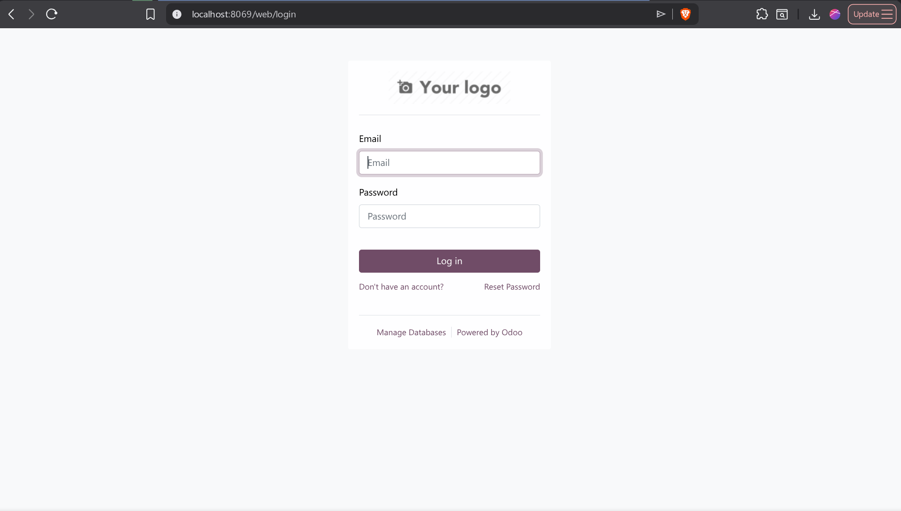
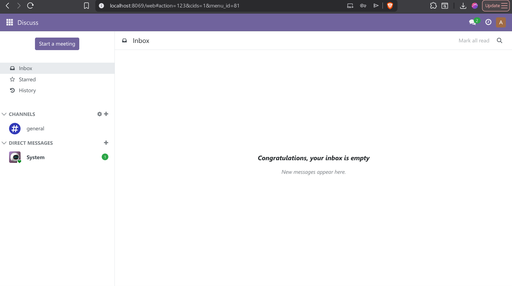
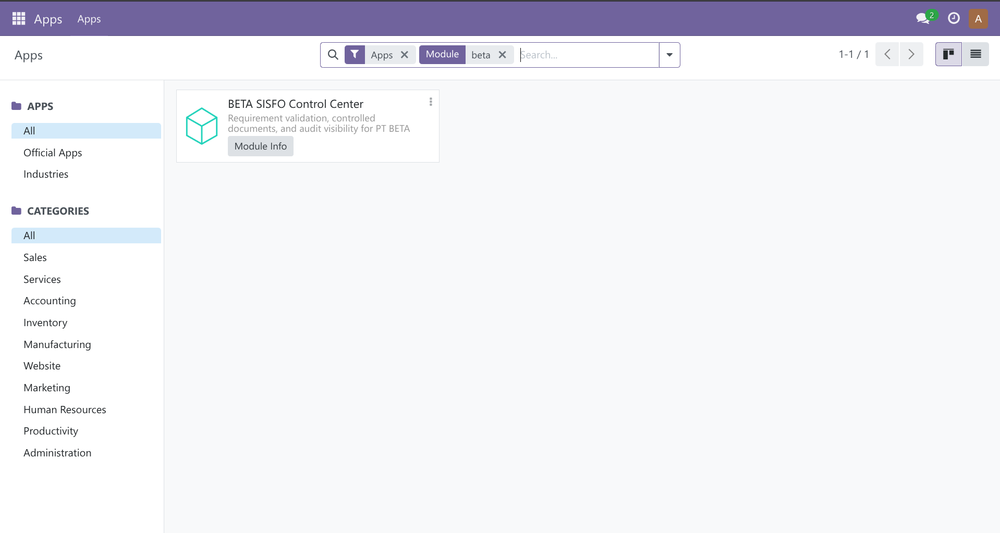

# IF3141 Implementasi Odoo - K02 G10

## Kelompok

- Kelompok: `G10`
- Kelas: `K02`
- Sistem: `BETA Control Center`
- Perusahaan: `PT Bentara Tabang Nusantara (BETA)`

| NIM | Nama |
|:-----|:------:|
| 13523063    |Syahrizal Bani Khairan       |
| 13523067    |Benedict Presley       |
| 13523080    |Diyah Susan Nugrahani       |
| 13523085    |Muhammad Jibril Ibrahim       |
| 13523090    |Nayaka Ghana Subrata       |
| 13523109    |Haegen Quinston       |

## Deskripsi Sistem

Repositori ini berisi implementasi Milestone 5 untuk sistem informasi PT BETA menggunakan Odoo 17 berbasis Docker. Fokus implementasi mengikuti hasil milestone sebelumnya: pengendalian dokumen terpusat, validasi requirement lintas divisi, keterlacakan proyek, dan visibilitas audit untuk mendukung kesiapan ISO 9001.

Karena image Odoo Community pada template ini tidak menyediakan modul `Documents`, implementasi akhir memakai kombinasi modul bawaan `CRM` dan `Project` ditambah satu custom add-on dari scratch bernama `beta_sisfo`. Add-on ini menyediakan `workspace`, alur `requirement validation`, register `controlled document`, log audit, dan seed data agar demo lintas role bisa langsung dijalankan.

## Fitur Utama

- `Workspaces`: ringkasan kesiapan per ruang kerja, jumlah requirement, dan status dokumen.
- `Requirement Validation`: alur Sales -> Engineering -> Project Officer untuk submit, revisi, validasi, dan penolakan requirement.
- `Controlled Documents`: pencatatan dokumen spesifikasi/kontrak/SOP dengan versi, status validasi, dan pembuatan revisi.
- `Audit Visibility`: daftar aksi penting yang tercatat setiap kali requirement atau dokumen berubah status.
- `CRM + Project Traceability`: requirement tervalidasi otomatis membuat `CRM Opportunity` dan `Project` terkait.

## Struktur Repo

- `config/`
  - konfigurasi Odoo
- `custom_addons/beta_sisfo/`
  - custom module utama implementasi
- `docs/`
  - dokumen milestone, panduan kelas, dan catatan fit-gap implementasi
- `dump/`
  - hasil export/import database
- `scripts/`
  - script migrasi database

## Cara Menjalankan

1. Jalankan stack Docker:

```bash
docker compose up -d
```

2. Buka Odoo di `http://localhost:8069`.

<p align="center">
    
</p>

3. Login sebagai admin:

```text
username: admin
password: admin
```

<p align="center">
    
</p>

4. Install atau upgrade custom module:

- buka menu `Apps`
- klik `Update Apps List`
- cari `BETA SISFO Control Center`
- klik `Install`

<p align="center">
    
</p>

Jika modul sudah pernah terpasang dan ada perubahan kode:

- klik `Upgrade` pada modul `BETA SISFO Control Center`
- bila perlu restart container:

```bash
docker compose restart web
```

<p align="center">
    
</p>

## Kredensial Demo Role

- `sales_user` / `sales123`
- `engineer_user` / `engineer123`
- `po_user` / `po123`
- `coo_user` / `coo123`

## Alur Demo yang Disarankan

1. Login sebagai `sales_user`, buka `BETA Control Center > Requirement Validation`, lalu buat atau buka requirement sample dan submit.
2. Login sebagai `engineer_user`, isi catatan engineering atau unggah dokumen draft pada tab `Controlled Documents`.
3. Login sebagai `po_user`, validasi requirement dan dokumen sampai sistem membuat tautan `CRM Opportunity` dan `Project`.
4. Login sebagai `coo_user`, buka `Workspaces` dan `Audit Visibility` untuk memantau kesiapan dan jejak perubahan.
5. Sebagai `po_user`, buka dokumen tervalidasi lalu klik `Create Revision` untuk mendemonstrasikan version control.

## Catatan Implementasi

- Modul ini sengaja meminimalkan kustomisasi dan memakai `CRM` + `Project` sebagai fondasi built-in.
- Fitur yang digantikan dari rencana awal `Documents` dibangun ulang secara ringan di `beta_sisfo` karena modul `documents` tidak tersedia pada image Odoo Community template ini.
- Seed data awal mencakup satu workspace, satu requirement, satu controlled document, dan empat user role.

## Database Migration

Sebelum export/import database, matikan service:

```bash
docker compose down
```

Export database:

- macOS/Linux

```bash
./scripts/export_db.sh
```

- Windows

```bat
scripts\export_db.cmd
```

Import database:

- macOS/Linux

```bash
./scripts/import_db.sh
```

- Windows

```bat
scripts\import_db.cmd
```

## Kesimpulan dan Saran

Implementasi ini memprioritaskan hasil yang paling aman untuk Milestone 5: sistem dapat didemokan end-to-end, role sudah disiapkan, dan satu custom module inti tersedia untuk menutup gap paling penting. Langkah lanjutan yang paling bernilai adalah memperkaya field metadata dokumen, memperketat record rules per role, dan menambahkan screenshot hasil implementasi untuk dokumen final milestone.
